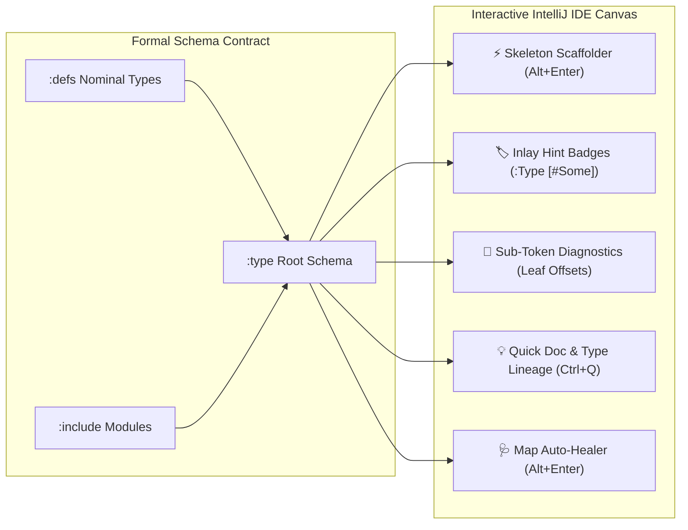
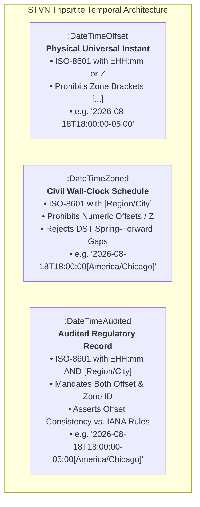

# STVN Plugin Developer Guide & Feature Handbook

**Strongly Typed Value Notation (STVN) for IntelliJ Platform**  
*An Authoritative, Example-Driven Guide for Software Engineers, Data Engineers, and System Architects*

---

## Table of Contents <!-- omit in toc -->

- [1. Core Philosophy & Quick Start](#1-core-philosophy--quick-start)
  - [1.1 Mathematical Typing Meets IDE Ergonomics](#11-mathematical-typing-meets-ide-ergonomics)
  - [1.2 The "Typic vs. Variable" Track (Colon `:` vs. Hash `#`)](#12-the-typic-vs-variable-track-colon--vs-hash-)
  - [1.3 Comparison Matrix: JSON vs. YAML vs. TOML vs. STVN](#13-comparison-matrix-json-vs-yaml-vs-toml-vs-stvn)
  - [1.4 60-Second Quick Start: Your First Valid STVN Document](#14-60-second-quick-start-your-first-valid-stvn-document)
- [2. Interactive Authoring & Scaffolding](#2-interactive-authoring--scaffolding)
  - [2.1 Schema-Driven Skeleton Generator (`Alt+Enter` on empty `:body`)](#21-schema-driven-skeleton-generator-altenter-on-empty-body)
    - [The Problem: Blank Canvas Friction](#the-problem-blank-canvas-friction)
    - [How the Skeleton Generator Works](#how-the-skeleton-generator-works)
    - [Interactive Live Template Tab-Stop Navigation Flow](#interactive-live-template-tab-stop-navigation-flow)
  - [2.2 Trap 2 Map Auto-Healer (`Alt+Enter` on Flat Lists in `:Map` Slots)](#22-trap-2-map-auto-healer-altenter-on-flat-lists-in-map-slots)
    - [The Mental Model: Maps vs. Lists](#the-mental-model-maps-vs-lists)
    - [One-Click Atomic Healing](#one-click-atomic-healing)
- [3. Visual Grammar & Inlay Hint Badging Guide](#3-visual-grammar--inlay-hint-badging-guide)
  - [3.1 Inlay Hint Badging Semantics: Explicit vs. Inferred Variant Tags](#31-inlay-hint-badging-semantics-explicit-vs-inferred-variant-tags)
    - [Option Types (`:Option( :T )`)](#option-types-option-t-)
    - [Either Types (`:Either( :L :R )`)](#either-types-either-l-r-)
    - [Algebraic Unions (`:Union( :T1 :T2 ... )`)](#algebraic-unions-union-t1-t2--)
    - [Master Visual Inlay Badging Key](#master-visual-inlay-badging-key)
    - [3.1.4 Temporal Primitives Inlay Hints & Hover Inspection](#314-temporal-primitives-inlay-hints--hover-inspection)
  - [3.2 Container Delimiter Signatures & Formatting](#32-container-delimiter-signatures--formatting)
  - [3.3 Configuration Settings & Long/Short Form Toggles](#33-configuration-settings--longshort-form-toggles)
- [4. Sub-Token Precision Diagnostics & Recovery](#4-sub-token-precision-diagnostics--recovery)
  - [4.1 Pinpoint Leaf-Token Error Targeting](#41-pinpoint-leaf-token-error-targeting)
  - [4.2 Guaranteed Structural Immunity for `:defs`, `:type`, and Root Enclosures](#42-guaranteed-structural-immunity-for-defs-type-and-root-enclosures)
  - [4.3 Real-Time Semantic Checkpoints](#43-real-time-semantic-checkpoints)
    - [Non-Empty Constraint Checking (`:SeqNonEmpty`, `:MapNonEmpty`)](#non-empty-constraint-checking-seqnonempty-mapnonempty)
    - [Duplicate Map Key Detection](#duplicate-map-key-detection)
    - [Zero-Shadowing Constraints](#zero-shadowing-constraints)
- [5. Navigation, Quick Documentation & Polyglot Features](#5-navigation-quick-documentation--polyglot-features)
  - [5.1 Jump-to-Definition Across Module Hierarchies (`Ctrl+Click` / `Ctrl+B`)](#51-jump-to-definition-across-module-hierarchies-ctrlclick--ctrlb)
  - [5.2 Quick Documentation & Nominal Lineage (`Ctrl+Q` / Hover)](#52-quick-documentation--nominal-lineage-ctrlq--hover)
  - [5.3 Polyglot Multi-Language Fenced Strings (`"""->[LANG] ... [LANG]"""`)](#53-polyglot-multi-language-fenced-strings--lang--lang)
  - [5.4 Workspace Dependency Flattening (`StvnFlattenWorkspaceAction`)](#54-workspace-dependency-flattening-stvnflattenworkspaceaction)
- [6. STVN Data Type Cheat Sheet for Data Engineers](#6-stvn-data-type-cheat-sheet-for-data-engineers)
  - [6.1 Atomic Primitives & Exact Numerics](#61-atomic-primitives--exact-numerics)
  - [6.2 Product Types: Tuples vs. Maps vs. Sequences](#62-product-types-tuples-vs-maps-vs-sequences)
  - [6.3 Sum Types: Options, Eithers, and Algebraic Unions](#63-sum-types-options-eithers-and-algebraic-unions)
  - [6.4 Enumerations & Value Keywords](#64-enumerations--value-keywords)
  - [6.5 Temporal Types: Epoch Timestamps vs. Tripartite DateTimes](#65-temporal-types-epoch-timestamps-vs-tripartite-datetimes)

---

## 1. Core Philosophy & Quick Start

### 1.1 Mathematical Typing Meets IDE Ergonomics

Strongly Typed Value Notation (STVN) is a high-assurance, human-readable data serialization language and formal algebraic type system. Unlike dynamically typed formats such as JSON, YAML, or TOML, where schema validation is an afterthought executed out-of-band, an STVN document is a **single-pass mathematically verified compilation unit**.

In STVN, every payload file (`.stvn`) establishes an exact, isomorphic contract between its schema envelope (`:type`) and its runtime data payload (`:body`).

The STVN IntelliJ Platform Plugin (`ij_stvnadore_plugin`) transforms this mathematical rigor into a rich, interactive compile-time canvas. Rather than burdening developers with manual boilerplate and syntactic traps, the IDE actively participates in data authoring:
* **Generates complete data skeletons** matching complex nominal types with a single keystroke.
* **Annotates unbracketed literals with compiler-inferred variant badges** directly in the editor viewport.
* **Pinpoints semantic and type mismatches down to the exact offending leaf token**.
* **Provides instant structural auto-healers** when transitioning from common JSON habits.



---

### 1.2 The "Typic vs. Variable" Track (Colon `:` vs. Hash `#`)

Traditional serialization languages mix schema directives, data keys, and literal values within the same lexical namespace, causing ambiguous parsing and accidental type-key collisions.

STVN strictly partitions the grammar into two physical tracks:

1. **The Typic Track (`:`)**: Every identifier or constructor prefixed with a colon (`:`) belongs to the type system. Colons define structural envelopes, nominal aliases, and collection constructors (e.g., `:Int32`, `:String`, `:Tuple`, `:Option`, `:Map`, `:DateTimeZoned`).
2. **The Variable / Value Track (`#`)**: Every identifier prefixed with a hash (`#`) represents a concrete algebraic variant tag, boolean literal, enumeration symbol, or metadata constraint (e.g., `#TRUE`, `#FALSE`, `#Some`, `#None`, `#Left`, `#Right`, `#1`, `#2`, `#preserveIndent`).

```stvn
{
  :defs {
    :Status :Option( :String ) // Colon ':' = Type Constructor
  }
  :type :Status
  :body #Some "active"         // Hash '#' = Algebraic Variant Tag
}
```

#### Why This Partition Matters
* **Single-Pass Parsing:** The lexer immediately determines whether a token governs type constraints or literal payload data without lookahead.
* **Ambiguity Elimination:** A value string or enumeration literal can never be mistaken for a type definition or structural keyword.
* **Zero-Allocation Deserialization:** Binary codecs and AST evaluators can jump directly to value offsets without re-parsing schema headers.

---

### 1.3 Comparison Matrix: JSON vs. YAML vs. TOML vs. STVN

| Feature / Dimension | JSON | YAML | TOML | STVN (`.stvn`) |
|:---|:---|:---|:---|:---|
| **Type Rigor** | None (Untyped) | Implicit (Loose) | Primitive Tables | Formal Algebraic Types (ADTs) |
| **Schema Binding** | Out-of-band (JSON Schema) | Out-of-band (SchemaStore) | None | Embedded In-File & Modular (`:include`) |
| **Sum Types (Unions)** | Ad-hoc (e.g. `{"type": "A"}`) | Tagged union hacks | Not supported | First-Class (`:Option`, `:Either`, `:Union`) |
| **Map Syntax** | `{ "k": "v" }` (Unordered) | `k: v` (Whitespace-sensitive) | `k = "v"` (Flat tables) | `{ [ "k" "v" ] }` (Ordered Sequenced Pairs) |
| **Null Safety** | Ambiguous `null` | Multi-form (`null`, `~`, empty) | Missing key semantics | Formal `:Option` (`#Some` / `#None`), Zero Nulls |
| **IDE Diagnostics** | Document-level | Indentation errors | Key syntax errors | Sub-Token Precision on leaf literals |
| **Editor Inlays** | None | Limited plugin hints | None | Contextual Inlay Badges & Closing Delimiters |

---

### 1.4 60-Second Quick Start: Your First Valid STVN Document

To create your first valid STVN document in IntelliJ IDEA:

1. Create a new file with the `.stvn` extension (e.g., `user_profile.stvn`).
2. Author the document below:

```stvn
{
  :defs {
    :UserId   :Int64
    :UserRole :Enum( #ADMIN #ENGINEER #ANALYST )
    :Location :Tuple( :Float64 :Float64 )
  }
  :type :Tuple(
    :UserId
    :StringNonEmpty
    :UserRole
    :Location
    :Option( :String )
  )
  :body (
    10042
    "ada.lovelace@stvnadore.org"
    #ENGINEER
    ( 51.5074 -0.1278 )
    "London Office" // Inlay badge automatically renders: :Option [#Some]
  )
}
```

Notice how the IDE immediately validates the payload:
* `10042` matches `:UserId` (`:Int64`).
* `"ada.lovelace@stvnadore.org"` satisfies `:StringNonEmpty`.
* `#ENGINEER` is validated against `:UserRole` enum tags.
* `( 51.5074 -0.1278 )` satisfies `:Location` (`:Tuple( :Float64 :Float64 )`).
* `"London Office"` is an untagged string, which the compiler automatically infers as `#Some "London Office"` under **Rule A**, displaying an inlay hint badge `:Option [#Some]`.

---

## 2. Interactive Authoring & Scaffolding

### 2.1 Schema-Driven Skeleton Generator (`Alt+Enter` on empty `:body`)

#### The Problem: Blank Canvas Friction
When authoring a complex, deeply nested STVN document, drafting the initial payload from scratch involves heavy cognitive load. A schema composed of nested maps, tuples, union branches, and optionals requires dozens of exact opening/closing delimiters (`{}`, `()`, `[]`), variant tags (`#1`, `#Some`), and mock literals.

#### How the Skeleton Generator Works
The STVN plugin introduces `StvnSchemaSkeletonIntentionAction`. When your caret is positioned on or immediately following an un-authored `:body` block, pressing `Alt+Enter` (macOS: `⌥Enter`) displays:

> 💡 **Generate schema data skeleton**

```
┌────────────────────────────────────────────────────────┐
│ :body <caret>                                          │
│ ┌────────────────────────────────────────────────────┐ │
│ │ 💡 Generate schema data skeleton                   │ │
│ │    STVN Schema Scaffolding                         │ │
│ └────────────────────────────────────────────────────┘ │
└────────────────────────────────────────────────────────┘
```

The underlying scaffolding engine (`StvnSchemaSkeletonScaffolder`):
1. Traverses the document's resolved `:type` schema via `StvnTypeResolver`.
2. Recursively expands all nominal aliases in `:defs` and `:include` files.
3. Generates a canonical, beautifully indented STVN AST containing standard mock default values:
   * `:Tuple(...)` &rarr; `( ... )`
   * `:Map(:K :V)` &rarr; `{ [ key val ] }`
   * `:Seq(:T)` / `:Set(:T)` &rarr; `[ item ]`
   * `:Option(:T)` &rarr; `#Some val`
   * `:Either(:L :R)` &rarr; `#Right val`
   * `:Union(:T1 :T2 ...)` &rarr; `#1 val`
   * `:Enum(#A #B ...)` &rarr; `#A`
   * Primitives &rarr; `0`, `0.0`, `"placeholder"`, `#FALSE`, `"2026-08-18T18:00:00-05:00"` (`:DateTimeOffset`), `"2026-08-18T18:00:00[America/Chicago]"` (`:DateTimeZoned`), `"2026-08-18T18:00:00-05:00[America/Chicago]"` (`:DateTimeAudited`).

#### Interactive Live Template Tab-Stop Navigation Flow

Once generated, the scaffold is automatically attached to an interactive IntelliJ `TemplateBuilderImpl`. Each generated mock literal becomes an active tab-stop:

```stvn
// 1. Author schema:
{
  :defs {
    :MetricPoint :Tuple( :String :Float64 :Boolean )
  }
  :type :Map( :String :MetricPoint )
  :body <caret>
}

// 2. Press Alt+Enter -> "Generate schema data skeleton":
{
  :defs {
    :MetricPoint :Tuple( :String :Float64 :Boolean )
  }
  :type :Map( :String :MetricPoint )
  :body {
    [ [|"placeholder"|] (   // <-- Tab-Stop 1 (Map Key)
      [|"placeholder"|]     // <-- Tab-Stop 2 (Metric Name)
      [|0.0|]               // <-- Tab-Stop 3 (Metric Value)
      [|#FALSE|]            // <-- Tab-Stop 4 (Active Flag)
    ) ]
  }
}
```

* Press **`Tab`** to confirm the current value and advance to the next field.
* Press **`Shift+Tab`** to move backward to the previous field.
* Press **`Enter`** or **`Esc`** to finalize the template.

---

### 2.2 Trap 2 Map Auto-Healer (`Alt+Enter` on Flat Lists in `:Map` Slots)

#### The Mental Model: Maps vs. Lists
Engineers migrating from JSON or Python frequently make "Trap 2": attempting to write map entries as flat lists or flat colon-pairs inside `:Map` slots:

```stvn
// ❌ INCORRECT (Trap 2: Flat list in map slot):
:body [ "host" "localhost" "port" 8080 ]
```

In STVN (§5.4), a `:Map` is an **ordered sequence of bracketed key-value entry pairs enclosed in braces**: `{ [ key value ] ... }`.

#### One-Click Atomic Healing
The plugin includes `StvnMapStructuralInspection` and `StvnMapAutoHealerQuickFix`. When a flat list literal is detected in a `:Map` slot:

1. The editor flags the flat list with a structural error.
2. Pressing `Alt+Enter` presents the quick-fix:
   > 💡 **Convert flat list to canonical map literal '{ [ ... ] }'**
3. The plugin atomically transforms the flat list into canonical paired entries, preserving single-line or multi-line formatting:

```stvn
// Before Quick-Fix:
:type :Map( :String :Int32 )
:body [ "api_port" 8080 "grpc_port" 9090 ]

// Press Alt+Enter -> Convert flat list to canonical map literal
// After Quick-Fix:
:type :Map( :String :Int32 )
:body { [ "api_port" 8080 ] [ "grpc_port" 9090 ] }
```

Multi-line lists are formatted with canonical indentation:

```stvn
// Multi-line Before:
:body [
  "alpha" 10
  "beta" 20
]

// Multi-line After Alt+Enter:
:body {
  [ "alpha" 10 ]
  [ "beta" 20 ]
}
```

---

## 3. Visual Grammar & Inlay Hint Badging Guide

### 3.1 Inlay Hint Badging Semantics: Explicit vs. Inferred Variant Tags

STVN's compiler implements algebraic inference rules that allow developers to omit boilerplate variant tags when there is no ambiguity. The STVN IntelliJ plugin provides **Type Inlay Hints** that clearly decode how the compiler interprets every value.

```
┌─────────────────────────────────────────────────────────────────────────────────┐
│ INLAY HINT BADGE CONVENTION:                                                    │
│ • Unbracketed Tag (#Tag)   = Explicitly Authored by Developer                   │
│ • Bracketed Tag   ([#Tag]) = Compiler-Inferred via Language Specification Rules │
└─────────────────────────────────────────────────────────────────────────────────┘
```

#### Option Types (`:Option( :T )`)
* **Explicit Tag:** `#Some "hello"` &rarr; renders badge `"hello" :Option #Some`
* **Inferred Tag (Rule A):** `"hello"` &rarr; renders badge `"hello" :Option [#Some]`
* **Explicit None:** `#None` &rarr; renders badge `#None :Option #None`

#### Either Types (`:Either( :L :R )`)
* **Explicit Left:** `#Left 404` &rarr; renders badge `404 :Either #Left`
* **Explicit Right:** `#Right "OK"` &rarr; renders badge `"OK" :Either #Right`
* **Inferred Right (Rule B):** `"OK"` &rarr; renders badge `"OK" :Either [#Right]`

#### Algebraic Unions (`:Union( :T1 :T2 ... )`)
In an N-way disjoint union where branches have distinct structural types (e.g. `:Int32`, `:String`, `:Boolean`):
* **Explicit Branch:** `#1 42` &rarr; renders badge `42 :Union #1`
* **Explicit Branch:** `#2 "data"` &rarr; renders badge `"data" :Union #2`
* **Inferred Branch 1 (Rule F/G):** `42` &rarr; renders badge `42 :Union [#1]`
* **Inferred Branch 2 (Rule F/G):** `"data"` &rarr; renders badge `"data" :Union [#2]`
* **Inferred Branch 3 (Rule F/G):** `#TRUE` &rarr; renders badge `#TRUE :Union [#3]`

#### Master Visual Inlay Badging Key

| Nominal Type Definition in `:defs`            | Document Payload Value  | Rendered Inlay Hint Badge       | Semantic Interpretation                  |
|:----------------------------------------------|:------------------------|:--------------------------------|:-----------------------------------------|
| `:OptDesc :Option( :String )`                 | `#Some "Ready"`         | `"Ready"` `:OptDesc #Some`      | Explicit Option `#Some` variant          |
| `:OptDesc :Option( :String )`                 | `"Ready"`               | `"Ready"` `:OptDesc [#Some]`    | Rule A Inferred `#Some` variant          |
| `:OptDesc :Option( :String )`                 | `#None`                 | `#None` `:OptDesc #None`        | Explicit Option `#None` variant          |
| `:Result :Either( :Int32 :String )`           | `#Left -1`              | `-1` `:Result #Left`            | Explicit Either `#Left` error branch     |
| `:Result :Either( :Int32 :String )`           | `"success"`             | `"success"` `:Result [#Right]`  | Rule B Inferred `#Right` success branch  |
| `:Payload :Union( :Int32 :String :Boolean )`  | `#1 100`                | `100` `:Payload #1`             | Explicit Union branch 1 (`:Int32`)       |
| `:Payload :Union( :Int32 :String :Boolean )`  | `100`                   | `100` `:Payload [#1]`           | Rule F Inferred Union branch 1           |
| `:Payload :Union( :Int32 :String :Boolean )`  | `"data"`                | `"data"` `:Payload [#2]`        | Rule F Inferred Union branch 2           |
| `:Payload :Union( :Int32 :String :Boolean )`  | `#FALSE`                | `#FALSE` `:Payload [#3]`        | Rule F Inferred Union branch 3           |

#### 3.1.4 Temporal Primitives Inlay Hints & Hover Inspection

The Tripartite Temporal Type System distinguishes between universal physical moments (**`:DateTimeOffset`**), civil jurisdictional schedules (**`:DateTimeZoned`**), and legally binding audited compliance logs (**`:DateTimeAudited`**). The STVN IntelliJ plugin provides comprehensive visual inlay badges, container closing signatures, and deep hover inspections (`Ctrl+Q` / `⌘J`) to ensure immediate clarity and prevent temporal bugs during authoring.

##### Rendered Inlay Badges for Temporal Literals

When temporal string literals are authored in collections, tuples, or alias slots, the plugin annotates each literal with its resolved primitive type and projects structural closing signatures on enclosing delimiters:

```stvn
{
  :type :Tuple(
    :DateTimeOffset
    :DateTimeZoned
    :DateTimeAudited
    :Seq( :DateTimeOffset )
  )
  :body (
    "2026-08-18T18:00:00-05:00"                  // Inlay badge: :DateTimeOffset
    "2026-08-18T18:00:00[America/Chicago]"        // Inlay badge: :DateTimeZoned
    "2026-08-18T18:00:00-05:00[America/Chicago]"  // Inlay badge: :DateTimeAudited
    [
      "2026-03-06T15:53:08Z"                      // Inlay badge: :DateTimeOffset
      "2026-03-06T09:53:08-06:00"                 // Inlay badge: :DateTimeOffset
    ]:Seq( :DateTimeOffset )                      // Closing container signature
  ):Tuple( :DateTimeOffset :DateTimeZoned :DateTimeAudited :Seq( :DateTimeOffset ) )
}
```

| Nominal / Structural Type | Document Payload Literal                       | Rendered Inlay Hint Badge                                 | Semantic Rules & Invariants                                                                                                                |
|:--------------------------|:-----------------------------------------------|:----------------------------------------------------------|:-------------------------------------------------------------------------------------------------------------------------------------------|
| `:DateTimeOffset`         | `"2026-08-18T18:00:00-05:00"`                  | `"..."` `:DateTimeOffset`                                 | Physical universal instant; mandates explicit offset (`±HH:mm` or `Z`); **prohibits** zone brackets (`[...]`).                             |
| `:DateTimeZoned`          | `"2026-08-18T18:00:00[America/Chicago]"`       | `"..."` `:DateTimeZoned`                                  | Civil wall-clock schedule; mandates IANA zone ID (`[Region/City]`); **prohibits** numerical offset / `Z`; rejects DST spring-forward gaps. |
| `:DateTimeAudited`        | `"2026-08-18T18:00:00-05:00[America/Chicago]"` | `"..."` `:DateTimeAudited`                                | Regulatory compliance record; **mandates** both offset AND IANA zone; compiler asserts offset consistency against zone rules.              |
| `:Seq( :DateTimeOffset )` | `[ "2026-03-06T15:53:08Z" ]`                   | `[ "..."` `:DateTimeOffset` `]` `:Seq( :DateTimeOffset )` | Homogeneous sequence with per-element hints and structural closing delimiter signature.                                                    |

##### Quick Documentation (`Ctrl+Q` / Hover) Inspection Tooltips

Hovering over any built-in temporal primitive keyword (`:DateTimeOffset`, `:DateTimeZoned`, `:DateTimeAudited`) or pressing **`Ctrl+Q`** (macOS: **`F1`** / **`Ctrl+J`**) invokes `StvnDocumentationProvider`, rendering dedicated HTML documentation cards with physical representations, lexical rules, and usage examples:

```
┌─────────────────────────────────────────────────────────────────────────────────┐
│ Primitive Type: :DateTimeOffset                                                 │
│ ─────────────────────────────────────────────────────────────────────────────── │
│ Represents an unambiguous physical instant on the universal timeline.           │
│ Lexical Form: ISO-8601 timestamp with explicit UTC offset (±HH:mm or Z).        │
│ Constraint: Prohibits IANA zone brackets ([...]).                               │
│ Example: "2026-08-18T18:00:00-05:00"                                            │
└─────────────────────────────────────────────────────────────────────────────────┘
```

```
┌─────────────────────────────────────────────────────────────────────────────────┐
│ Primitive Type: :DateTimeZoned                                                  │
│ ─────────────────────────────────────────────────────────────────────────────── │
│ Represents a civil wall-clock schedule bound to an IANA time zone jurisdiction. │
│ Lexical Form: ISO-8601 local timestamp with bracketed IANA zone ID              │
│               ([Region/City]).                                                  │
│ Constraint: Prohibits explicit numerical offsets (±HH:mm) or Z. Validates DST   │
│             transition gaps.                                                    │
│ Example: "2026-08-18T18:00:00[America/Chicago]"                                 │
└─────────────────────────────────────────────────────────────────────────────────┘
```

```
┌─────────────────────────────────────────────────────────────────────────────────┐
│ Primitive Type: :DateTimeAudited                                                │
│ ─────────────────────────────────────────────────────────────────────────────── │
│ Represents an audited compliance record capturing both observed UTC offset      │
│ and regulatory IANA jurisdiction.                                               │
│ Lexical Form: ISO-8601 timestamp with explicit UTC offset AND bracketed IANA    │
│               zone ID.                                                          │
│ Constraint: Mandates both offset and zone. Validates offset consistency against │
│             IANA zone rules for that date-time.                                 │
│ Example: "2026-08-18T18:00:00-05:00[America/Chicago]"                           │
└─────────────────────────────────────────────────────────────────────────────────┘
```

##### Deep Semantic Assertions & Diagnostics

The background compiler and real-time annotator execute sub-token diagnostic verification on all temporal literals:

1. **UTC Instant Calculations & Zone Bracket Prohibition (`:DateTimeOffset`):**
   * Physical universal instants have no jurisdictional rules. If zone brackets are inadvertently appended, the annotator flags the literal with pinpoint precision:
   ```stvn
   :type :DateTimeOffset
   :body "2026-08-18T18:00:00-05:00[America/Chicago]"
         ~~~~~~~~~~~~~~~~~~~~~~~~~~~~~~~~~~~~~~~~~~~~ <-- Error: "Time zone brackets [...] are prohibited in :DateTimeOffset"
   ```

2. **IANA Zone Rule Resolutions & DST Spring-Forward Gap Validation (`:DateTimeZoned`):**
   * Civil wall-clock appointments must dynamically follow daylight saving rules. Specifying an explicit numerical offset (which locks an astronomical instant) is prohibited:
   ```stvn
   :type :DateTimeZoned
   :body "2026-03-15T08:00:00-05:00[America/Chicago]"
         ~~~~~~~~~~~~~~~~~~~~~~~~~~~~~~~~~~~~~~~~~~~~ <-- Error: "Explicit offsets (e.g. -05:00 or Z) are prohibited in :DateTimeZoned"
   ```
   * The compiler queries the IANA Zone Database for the specified region. If a time falls into a DST spring-forward "clock jump" gap (e.g., 2:30 AM on March 8, 2026 in `America/Chicago` when local clocks advance from 02:00 directly to 03:00), the editor highlights the impossible wall-clock value:
   ```stvn
   :type :DateTimeZoned
   :body "2026-03-08T02:30:00[America/Chicago]"
         ~~~~~~~~~~~~~~~~~~~~~~~~~~~~~~~~~~~~~~ <-- Error: "Local date-time 2026-03-08T02:30:00 falls into a DST spring-forward gap in zone America/Chicago"
   ```

3. **Audit Compliance Assertions & Offset Consistency Checks (`:DateTimeAudited`):**
   * In regulated domains (finance, healthcare, legal signing), records must preserve both what the local wall-clock indicated (jurisdiction) and the exact physical instant when the record was stamped (offset). Omitting either component triggers a compile error:
   ```stvn
   :type :DateTimeAudited
   :body "2026-03-15T08:00:00-05:00"
         ~~~~~~~~~~~~~~~~~~~~~~~~~~~ <-- Error: "Mandates both an explicit UTC offset and an IANA zone ID"
   ```
   * The compiler verifies that the explicit offset is mathematically consistent with the IANA zone rules for that local moment. If a mismatched offset is supplied, the compiler rejects it:
   ```stvn
   :type :DateTimeAudited
   :body "2026-03-15T08:00:00-07:00[America/Chicago]"
         ~~~~~~~~~~~~~~~~~~~~~~~~~~~~~~~~~~~~~~~~~~~~ <-- Error: "Contradictory offset in :DateTimeAudited literal: expected -05:00, got -07:00"
   ```

---

### 3.2 Container Delimiter Signatures & Formatting

To prevent confusion in large, nested documents with many closing parentheses and brackets, the plugin projects container closing signatures with canonical single-space padding:

```stvn
{
  :defs {
    :Metric :Tuple( :String :Float64 )
  }
  :type :Tuple( :Int32 :Metric :Option( :String ) )
  :body (
    101
    ( "cpu_util" 98.4 ):Metric( :String :Float64 )
    "primary"
  ):Tuple( :Int32 :Metric :Option( :String ) )
}
```

* **Tuples:** `):Tuple( :T1 :T2 ... )`
* **Maps:** `}:Map( :KeyType :ValType )`
* **Sequences:** `]:Seq( :ElemType )`
* **Sets:** `]:Set( :ElemType )`

---

### 3.3 Configuration Settings & Long/Short Form Toggles

You can configure STVN inlay hints and presentation options under:  
**Settings / Preferences | Languages & Frameworks | STVN** (or search `STVN` in Settings).

```
┌────────────────────────────────────────────────────────────────────────┐
│ Settings > Languages & Frameworks > STVN                               │
├────────────────────────────────────────────────────────────────────────┤
│ Inlay Hints & Annotations:                                             │
│ [X] Show Type Inlay Hints                                              │
│ [X] Use Long-Form Sum Types (#Some / #Right vs. #S / #R)               │
│ [X] Show Hover Documentation                                           │
└────────────────────────────────────────────────────────────────────────┘
```

* **Show Type Inlay Hints:** Toggles real-time type and closing delimiter hints in the editor.
* **Use Long-Form Sum Types (Default: Checked):**
  * When **Checked (Long Form):** Renders `:OptText #Some`, `:OptText [#Some]`, `:Disjoint #Right`, `:Disjoint [#Right]`.
  * When **Unchecked (Short Form):** Renders ultra-compact badges: `:OptText #S`, `:OptText [#S]`, `:Disjoint #R`, `:Disjoint [#R]`, `:Disjoint #L`, `:OptText #N`.
* **Show Hover Documentation:** Enables rich HTML type lineage and schema inspection popups on hover.

---

## 4. Sub-Token Precision Diagnostics & Recovery

### 4.1 Pinpoint Leaf-Token Error Targeting

In legacy tools, schema mismatches often cause a "whole-document red squiggly," painting the entire file red from line 1 to the end.

The STVN IntelliJ plugin implements **Sub-Token Precision Targeting** via `StvnExternalAnnotator`. Diagnostics computed by the background `StvnCompiler` are mapped directly to exact byte and character offsets of the specific offending leaf literal:

```stvn
{
  :defs {
    :DisjointUnion :Union( :Int32 :Boolean :Float64 :String )
  }
  :type :Tuple( :DisjointUnion )
  :body (
    #1 1024.0
       ~~~~~~ <-- Error strictly on "1024.0": "Type mismatch: Expected :Int32, got :Float64"
  )
}
```

---

### 4.2 Guaranteed Structural Immunity for `:defs`, `:type`, and Root Enclosures

The plugin strictly enforces the **Structural Immunity Invariant**:
* Errors in `:body` payload values **never** bleed upward to highlight root curly braces `{ ... }`, the `:defs` block, or the `:type` header.
* If a payload literal is invalid, only that literal is underlined. Your schema definitions remain visually clean and stable.

```
┌─────────────────────────────────────────────────────────┐
│ IMMUNITY BOUNDARY GUARANTEE:                            │
│ {                                    <- [IMMUNE]        │
│   :defs { :Id :Int32 }               <- [IMMUNE]        │
│   :type :Tuple( :Id )                <- [IMMUNE]        │
│   :body (                            <- [IMMUNE]        │
│     "invalid_id"                     <- [ERROR HIGHLIGHT]
│   )                                  <- [IMMUNE]        │
│ }                                    <- [IMMUNE]        │
└─────────────────────────────────────────────────────────┘
```

---

### 4.3 Real-Time Semantic Checkpoints

#### Non-Empty Constraint Checking (`:SeqNonEmpty`, `:MapNonEmpty`)
When a schema specifies non-empty collections (`:SeqNonEmpty`, `:SetNonEmpty`, `:MapNonEmpty`), supplying an empty literal immediately highlights the empty brackets:

```stvn
:type :SeqNonEmpty( :String )
:body []
      ~~ <-- Error: "Collection is marked as non-empty but contains no elements"
```

#### Duplicate Map Key Detection
STVN maps require strictly unique keys (§5.4). Duplicate keys are detected and highlighted on the second key occurrence:

```stvn
:type :Map( :String :Int32 )
:body {
  [ "timeout" 30 ]
  [ "timeout" 60 ]
    ~~~~~~~~~ <-- Error: "Duplicate map key detected: 'timeout'"
}
```

#### Zero-Shadowing Constraints
STVN enforces strict **Zero-Shadowing**: you cannot declare duplicate type alias names or duplicate constant identifiers within the same scope or across imported `:include` modules. The plugin highlights the conflicting name in `:defs` immediately.

---

## 5. Navigation, Quick Documentation & Polyglot Features

### 5.1 Jump-to-Definition Across Module Hierarchies (`Ctrl+Click` / `Ctrl+B`)

STVN supports modular schema architecture via `.stvn_incl` (module definitions) and `.stvn_inclf` (flattened modules).

* Place your cursor on any nominal type (e.g. `:UserId`, `:OrderHeader`) in `:type` or `:body` and press **`Ctrl+B`** (macOS: **`⌘B`**) or **`Ctrl+Click`** (macOS: **`⌘Click`**).
* The editor navigates instantly across files to the exact line in `:defs` or `:include` where the type was declared.

```stvn
// In orders.stvn:
{
  :include { "schemas/common_types.stvn_incl" }
  :type :UserProfile // Ctrl+Click jumps directly to common_types.stvn_incl!
  :body ...
}
```

---

### 5.2 Quick Documentation & Nominal Lineage (`Ctrl+Q` / Hover)

Pressing **`Ctrl+Q`** (macOS: **`F1`** or **`Ctrl+J`**) or hovering over any type or value displays the STVN Quick Documentation popup:

```
┌────────────────────────────────────────────────────────┐
│ Type Alias: :ShippingAddress                           │
│ Resolution Path: :ShippingAddress -> :PostalLocation   │
│                  -> :Tuple( :String :String :Int32 )   │
│ ────────────────────────────────────────────────────── │
│ Underlying Structure: :Tuple( :String :String :Int32 ) │
└────────────────────────────────────────────────────────┘
```

The documentation popup reveals:
1. **Type Lineage & Resolution Path:** Shows the complete alias trace if an alias points to another alias.
2. **Underlying Concrete Structure:** Formats the final structural AST.
3. **Value Type & Evaluation:** For payload values, shows the resolved type, active variant branch, and parsed literal value.

---

### 5.3 Polyglot Multi-Language Fenced Strings (`"""->[LANG] ... [LANG]"""`)

Data pipelines often embed queries, templates, or scripts inside data files. STVN provides native **Fenced String Literals** with dedicated syntax highlighting:

```stvn
{
  :defs {
    :QueryDef :Tuple( :String :String )
  }
  :type :QueryDef
  :body (
    "user_analytics"
    """->[SQL]
    SELECT
      u.user_id,
      u.email,
      COUNT(o.order_id) AS total_orders
    FROM users u
    LEFT JOIN orders o ON u.user_id = o.user_id
    WHERE u.active = 1
    GROUP BY u.user_id, u.email;
    [SQL]"""
  )
}
```

Supported language fences include:
* `"""->[SQL] ... [SQL]"""` &rarr; SQL query syntax
* `"""->[JSON] ... [JSON]"""` &rarr; Embedded JSON payloads
* `"""->[PYTHON] ... [PYTHON]"""` &rarr; Python transformation scripts
* `"""->[BASH] ... [BASH]"""` / `"""->[SHELL] ... [SHELL]"""` &rarr; Shell commands

---

### 5.4 Workspace Dependency Flattening (`StvnFlattenWorkspaceAction`)

When preparing STVN schemas for production deployments or microservice distribution, you can bundle modular multi-file schemas into a single standalone `.stvn_inclf` archive:

1. Right-click any `.stvn` or `.stvn_incl` file in the **Project View**.
2. Select **Flatten STVN Workspace** (also available under the **Build** menu).
3. The plugin resolves all relative `:include` paths, checks for namespace collisions and circular dependencies, strips redundant comments, and exports a canonical `.stvn_inclf` file.

---

## 6. STVN Data Type Cheat Sheet for Data Engineers

### 6.1 Atomic Primitives & Exact Numerics

| STVN Type         | Physical Domain / Range         | Example Literal                | Notes & Invariants               |
|:------------------|:--------------------------------|:-------------------------------|:---------------------------------|
| `:Boolean`        | Logical truth                   | `#TRUE`, `#FALSE` (`#T`, `#F`) | Strict uppercase value keywords  |
| `:Int8`           | -128 to 127                     | `-42`, `127`                   | Signed 8-bit integer             |
| `:Int16`          | -32,768 to 32,767               | `1024`, `-32000`               | Signed 16-bit integer            |
| `:Int32`          | -2,147,483,648 to 2,147,483,647 | `0`, `499999`                  | Default 32-bit signed integer    |
| `:Int64`          | -9.22e18 to 9.22e18             | `9223372036854775807`          | Signed 64-bit integer            |
| `:Uint8`          | 0 to 255                        | `0`, `255`                     | Unsigned 8-bit byte              |
| `:Uint16`         | 0 to 65,535                     | `8080`, `65535`                | Unsigned 16-bit word             |
| `:Uint32`         | 0 to 4,294,967,295              | `4000000000`                   | Unsigned 32-bit integer          |
| `:Uint64`         | 0 to 1.84e19                    | `18446744073709551615`         | Unsigned 64-bit integer          |
| `:Float32`        | IEEE-754 32-bit Float           | `3.14159`, `-0.5`              | Requires explicit decimal point  |
| `:Float64`        | IEEE-754 64-bit Float           | `2.718281828459045`            | Standard double precision        |
| `:FloatExact`     | Arbitrary Decimal               | `1099.995`                     | Exact decimal for financial math |
| `:String`         | UTF-8 Text String               | `"hello world"`                | Standard escaped string          |
| `:StringNonEmpty` | UTF-8 Text ($\ge 1$ char)       | `"alpha"`                      | Compile error on `""`            |
| `:StringFixed(N)` | Exactly $N$ Unicode chars       | `"US"` (for $N=2$)             | Compile error if length $\ne N$  |

---

### 6.2 Product Types: Tuples vs. Maps vs. Sequences

| Constructor             | Enclosure                   | Payload Syntax                | Description                      |
|:------------------------|:----------------------------|:------------------------------|:---------------------------------|
| `:Tuple( :T1 :T2 ... )` | Parentheses `()`            | `( 100 "active" #TRUE )`      | Heterogeneous ordered product    |
| `:Map( :K :V )`         | Braces `{}` + Brackets `[]` | `{ [ "k1" 10 ] [ "k2" 20 ] }` | Sequenced unique key-value pairs |
| `:MapNonEmpty( :K :V )` | Braces `{}` + Brackets `[]` | `{ [ "k1" 10 ] }`             | Requires at least 1 entry        |
| `:MapInv( :K :V )`      | Braces `{}` + Brackets `[]` | `{ [ "k1" 10 ] }`             | Invertible map (unique values)   |
| `:Seq( :T )`            | Brackets `[]`               | `[ 10 20 30 ]`                | Ordered homogeneous sequence     |
| `:SeqNonEmpty( :T )`    | Brackets `[]`               | `[ 10 ]`                      | Sequence with $\ge 1$ element    |
| `:Set( :T )`            | Brackets `[]`               | `[ "a" "b" "c" ]`             | Homogeneous unique elements      |
| `:SetNonEmpty( :T )`    | Brackets `[]`               | `[ "a" ]`                     | Set with $\ge 1$ element         |

---

### 6.3 Sum Types: Options, Eithers, and Algebraic Unions

| Sum Type Constructor    | Explicit Syntax             | Inferred Syntax (Rule)      | Inlay Hint Badge                      |
|:------------------------|:----------------------------|:----------------------------|:--------------------------------------|
| `:Option( :T )`         | `#Some "value"` / `#None`   | `"value"` (Rule A)          | `:Option [#Some]` / `:Option #None`   |
| `:Either( :L :R )`      | `#Left 400` / `#Right "ok"` | `"ok"` (Rule B)             | `:Either #Left` / `:Either [#Right]`  |
| `:Union( :T1 :T2 ... )` | `#1 100` / `#2 "text"`      | `100` / `"text"` (Rule F/G) | `:Union [#1]` / `:Union [#2]`         |

---

### 6.4 Enumerations & Value Keywords

Enumerations define finite sets of constant value keywords:

```stvn
:defs {
  :Environment :Enum( #DEVELOPMENT #STAGING #PRODUCTION )
}
:type :Environment
:body #PRODUCTION
```

* Enum tags always begin with `#` and uppercase identifiers.
* Autocompletion suggestions trigger automatically after `#`.

---

### 6.5 Temporal Types: Epoch Timestamps vs. Tripartite DateTimes

STVN partitions temporal data into two distinct domains: low-level Unix epoch counters for machine processing and a formalized **Tripartite Temporal Type System** for ISO-8601 calendar representations.

#### Machine-Level Epoch Timestamps

| Type Constructor | Semantic Meaning                                | Example Literal       | Format Specification                  |
|:-----------------|:------------------------------------------------|:----------------------|:--------------------------------------|
| `:TimeEpochS`    | Seconds since Unix epoch (1970-01-01T00:00:00Z) | `1773792000`          | Signed 64-bit integer Unix seconds    |
| `:TimeEpochMs`   | Milliseconds since Unix epoch                   | `1773792000000`       | High-precision milliseconds integer   |
| `:TimeEpochNs`   | Nanoseconds since Unix epoch                    | `1773792000000000000` | Nanosecond telemetry/system timestamp |

#### The Tripartite Temporal Type System

To eliminate ambiguities between physical timeline moments, civil calendar appointments, and legally immutable records, STVN provides three distinct ISO-8601 date-time primitives:



| Type Constructor       | Semantic Role                | Example Literal                                                                     | Required Format & Constraints            | Prohibitions & Compiler Assertions                                                                      |
|:-----------------------|:-----------------------------|:------------------------------------------------------------------------------------|:-----------------------------------------|:--------------------------------------------------------------------------------------------------------|
| **`:DateTimeOffset`**  | Physical universal instant   | `"2026-08-18T18:00:00-05:00"`<br/>`"2026-08-18T23:00:00Z"`                          | `YYYY-MM-DDTHH:mm:ss±HH:mm` or `Z`       | **Prohibits zone brackets (`[...]`)**.<br/>Represents an exact astronomical timeline moment.            |
| **`:DateTimeZoned`**   | Civil wall-clock schedule    | `"2026-08-18T18:00:00[America/Chicago]"`<br/>`"2026-08-18T18:30:00[Europe/London]"` | `YYYY-MM-DDTHH:mm:ss[Region/City]`       | **Prohibits numerical offsets (`±HH:mm`) and `Z`**.<br/>**Rejects DST spring-forward clock jump gaps**. |
| **`:DateTimeAudited`** | Regulatory compliance record | `"2026-08-18T18:00:00-05:00[America/Chicago]"`                                      | `YYYY-MM-DDTHH:mm:ss±HH:mm[Region/City]` | **Mandates both offset and zone ID**.<br/>**Asserts consistency** between offset and IANA zone rules.   |

#### Architectural Decision Guide: Which Temporal Type to Choose?

* **Use `:DateTimeOffset` when:**
  * Recording physical events on the universal timeline (e.g., IoT telemetry, distributed tracing spans, server access logs, immutable payment authorizations).
  * You require unambiguous chronological ordering across distributed systems regardless of geographical boundaries.
* **Use `:DateTimeZoned` when:**
  * Scheduling human-facing future events (e.g., recurring meetings, flight departures, webinars, billing cycle runs).
  * The local wall-clock time must remain fixed even if daylight saving regulations or political time zone boundaries shift before the scheduled event.
* **Use `:DateTimeAudited` when:**
  * Recording legally binding financial, medical, or regulatory transactions (e.g., electronic signatures, tax audit trails, clinical trial logs).
  * You must capture both the exact physical timeline instant (numerical offset) and the legal jurisdictional authority (IANA zone identifier) under which the transaction occurred.

---

## 7. Keyboard Shortcut Quick Reference

| Feature                     | Action Name                     | Windows / Linux         | macOS                      |
|:----------------------------|:--------------------------------|:------------------------|:---------------------------|
| **Scaffold Data Skeleton**  | Schema Skeleton Intention       | `Alt+Enter`             | `⌥Enter` / `Option+Return` |
| **Heal Flat Map List**      | Convert flat list to map        | `Alt+Enter`             | `⌥Enter` / `Option+Return` |
| **Next Scaffold Field**     | Next Live Template Variable     | `Tab`                   | `Tab`                      |
| **Previous Scaffold Field** | Previous Live Template Variable | `Shift+Tab`             | `⇧Tab`                     |
| **Quick Documentation**     | Show Documentation & Lineage    | `Ctrl+Q`                | `F1` / `Ctrl+J`            |
| **Jump to Definition**      | Go to Type/Constant Declaration | `Ctrl+B` / `Ctrl+Click` | `⌘B` / `⌘Click`            |
| **Flatten Workspace**       | Flatten STVN Workspace Action   | *Project Menu / Build*  | *Project Menu / Build*     |

---

*Authored by the STVN Lead Technical Documentation Architecture & IntelliJ Platform SDK Engineering Team.*
