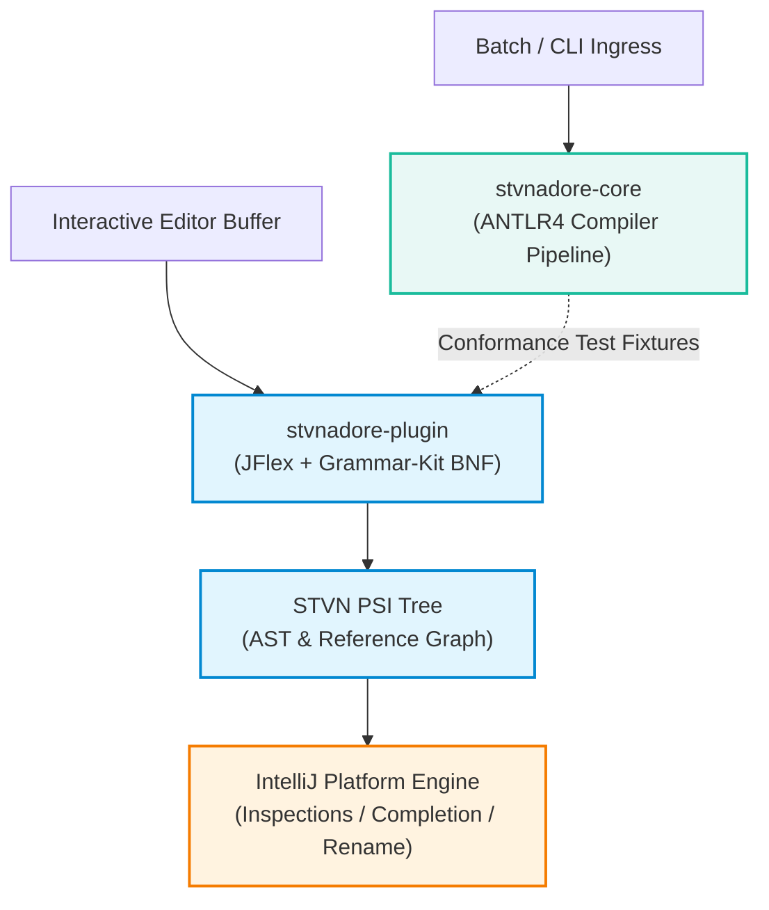
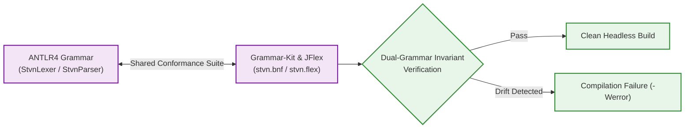
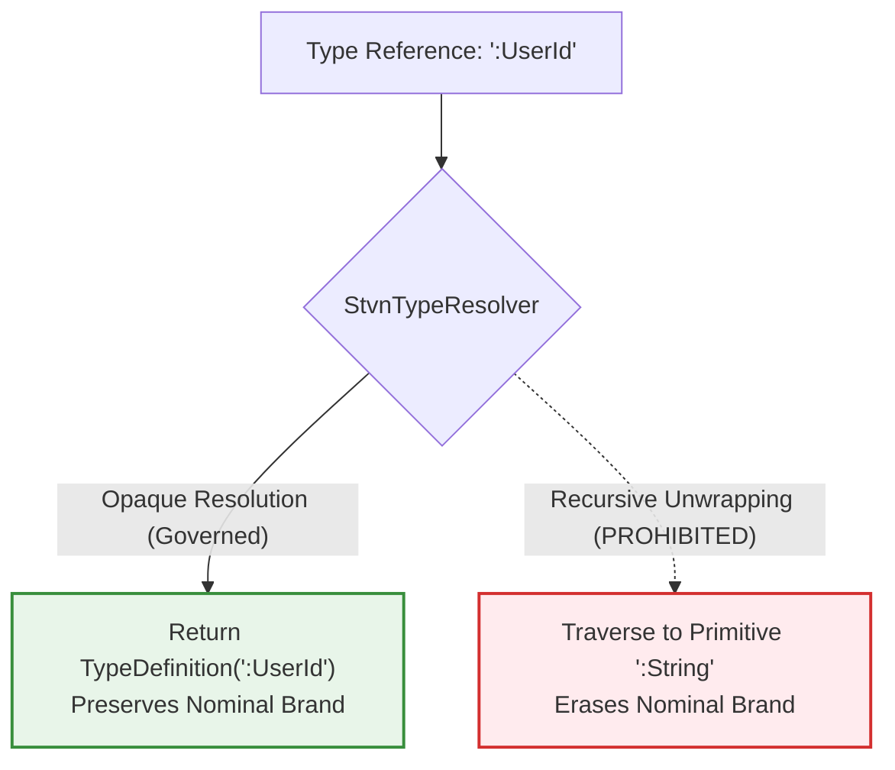
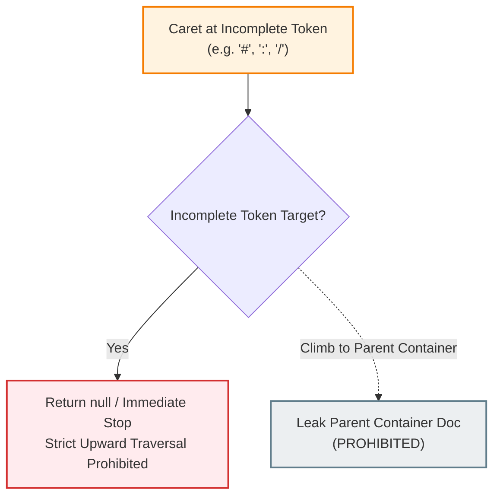
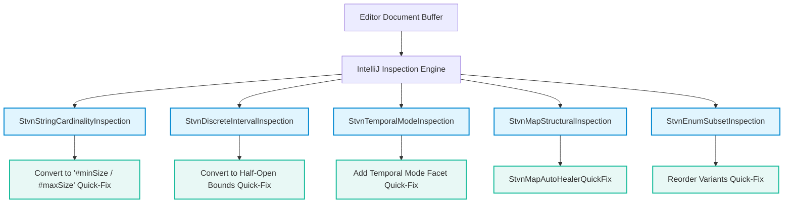

# STVN Architecture Specification: IntelliJ Platform Plugin & Interactive PSI Governance

**Document ID:** `STVN-SPEC-PLUGIN-01`  
**Status:** Canonical Architecture Specification  
**Version:** `1.0.0-PROPOSAL`  
**Target Repository:** `stvnadore-plugin` (`ij_stvnadore_plugin`)  
**Target Version Baseline:** `2.0.0-PROPOSAL`  
**Governing Standard:** Simplified Technical English (STE-01 through STE-07)  
**Foundational Baselines:**  
- `STVN_LANGUAGE_SPEC.md` (v1.3.1 baseline)  
- `STVN-VOP-MANIFESTO.md` (Value-Oriented Programming Canonical Foundations)  
- [`docs/architecture/STVN_REPOSITORY_SPEC.md`](file:///c:/Projects/Java/stvnadore/ij_stvnadore_repository/docs/architecture/STVN_REPOSITORY_SPEC.md) (v1.0.0-PROPOSAL)  
- [`docs/architecture/STVN_CHESS_SHOWCASE_SPEC.md`](file:///c:/Projects/Java/stvnadore/ij_stvnadore_example_chess/docs/architecture/STVN_CHESS_SHOWCASE_SPEC.md) (v1.0.0-PROPOSAL)  
- [`IMPLEMENTATION_PROPOSAL_CORE_GRAMMAR_V2.md`](file:///c:/Projects/Java/stvnadore/ij_stvnadore_core/temp/docs/implementation_proposals/IMPLEMENTATION_PROPOSAL_CORE_GRAMMAR_V2.md)  
- [`IMPLEMENTATION_PROPOSAL_REPOSITORY_V2.md`](file:///c:/Projects/Java/stvnadore/ij_stvnadore_repository/temp/docs/implementation_proposals/IMPLEMENTATION_PROPOSAL_REPOSITORY_V2.md)  
- [`IMPLEMENTATION_PROPOSAL_CHESS_SHOWCASE_V2.md`](file:///c:/Projects/Java/stvnadore/ij_stvnadore_example_chess/temp/docs/implementation_proposals/IMPLEMENTATION_PROPOSAL_CHESS_SHOWCASE_V2.md)  
**Toolchain:** Java 21 LTS | Gradle 8.x | IntelliJ Platform SDK 2025.3  

---

## 1. Scope & Dual-Grammar Synchronization Invariant

### 1.1 The Ecosystem Role of the IntelliJ Plugin

The STVN IntelliJ Platform plugin (`stvnadore-plugin`) serves as the interactive developer experience (DX) surface for the STVN ecosystem. While the upstream compiler (`stvnadore-core`) operates in headless, batch, or CLI contexts, the plugin executes inside the interactive IntelliJ editor thread under partial, unclosed, and syntactically incomplete keystroke sequences.

The plugin provides six primary capabilities:
1. **Interactive Lexical & Syntax Highlighting:** Provides token-accurate lexical classification via JFlex (`stvn.flex`) and Grammar-Kit BNF (`stvn.bnf`).
2. **Program Structure Interface (PSI) Tree Construction:** Builds an incremental PSI representation enabling code folding, navigation, and structural search.
3. **Opaque Nominal Reference Resolution:** Resolves cross-file and intra-file type references while strictly preserving opaque nominal type wrappers.
4. **Context-Aware In-Flight Auto-Completion:** Contributes schema-directed value templates, enum variants, and sum constructors without leaking parent container scopes.
5. **Real-Time Inspections & Automated Quick-Fixes:** Flags grammar deprecations, invalid facets, discrete bound errors, and structural layout mistakes directly in the editor buffer.
6. **Value-Oriented Rename Refactoring:** Executes atomic symbol renaming across schema declarations, usage sites, and standard library namespaces.

### 1.2 The Dual-Grammar Synchronization Invariant

The STVN ecosystem enforces a strict dual-grammar architecture:
- **Headless Authority:** ANTLR4 (`StvnLexer.g4` and `StvnParser.g4` in `stvnadore-core`).
- **Interactive Authority:** Grammar-Kit BNF (`stvn.bnf`) and JFlex (`stvn.flex` in `stvnadore-plugin`).

To prevent architectural drift and syntax divergence, the plugin adheres to the **Dual-Grammar Synchronization Invariant**:

$$\mathcal{T}_{\text{ANTLR4}} \equiv \mathcal{T}_{\text{JFlex}} \quad \land \quad \mathcal{P}_{\text{ANTLR4}}(s) \cong \mathcal{P}_{\text{Grammar-Kit}}(s)$$

For every source document $s \in \Sigma^*$:
1. **Token Taxonomy Identity:** Every terminal token recognized by `StvnLexer.g4` must have an exact equivalent token in `stvn.flex` with identical boundary rules.
2. **Parse Tree Homomorphism:** The hierarchical structure of the ANTLR4 parse tree must map homomorphically to the Grammar-Kit generated PSI tree.
3. **Compound Token Elimination:** All legacy compound tokens removed from ANTLR4 in STVN 2.0.0 (`:Uint4`, `:Int16`, `:String8`, `:StringFixed36`, `:SeqNonEmpty`, `:MapInv`) must be removed from `stvn.bnf` and `stvn.flex`. Both grammars parse base types qualified by metadata facet blocks.
4. **Strict Fenced String Delimiter Invariant (Rule STR-04):** Both ANTLR4 (`StvnLexer.g4`) and JFlex (`stvn.flex`) strictly enforce delimiter pattern `"""[TAG]` without directional arrow syntax. The deprecated prefix `"""->[` is permanently prohibited in both ANTLR4 and JFlex; encountering `"""->[` must trigger immediate fatal syntax rejection at the lexical boundary.

---

## 2. PSI Accessor & Opaque Nominal Resolution Governance

### 2.1 The Prohibition of Recursive Nominal Unwrapping

Under Value-Oriented Programming (VOP), nominal types represent distinct domain entities even when their structural definitions are identical:
$$\text{NominalSchema}(:UserId) \neq \text{NominalSchema}(:AccountId)$$

Legacy PSI resolvers implemented recursive schema unwrapping inside `StvnTypeResolver.resolveNominalSchema`. When resolving a nominal alias, the resolver repeatedly traversed the reference chain until reaching a primitive base type. This recursive unwrapping produced three severe architectural defects:
1. **Nominal Erasure:** Collapsed unique domain types into bare primitives (`:String`), destroying nominal boundaries in type inference.
2. **False Type Equivalence:** Treated `:UserId` and `:AccountId` as interchangeable types during auto-completion and validation.
3. **Cyclic Traversal Loops:** Induced editor thread hangs on recursive type definitions.

**Governance Mandate:** Recursive nominal unwrapping is prohibited. `StvnTypeResolver.resolveNominalSchema` must execute shallow resolution:
- When given a nominal reference (e.g. `:UserId`), the resolver must resolve to the authoritative `TypeDefinition` node representing that alias.
- The resolver must retain the nominal wrapper (`:UserId`) as an opaque type brand.
- The underlying structural schema is accessed only when evaluating physical payload conformance or formatting underlying type documentation.

### 2.2 PSI Navigation Contracts & Mixin Taxonomy

The plugin structures PSI nodes using dedicated mixins and navigation interfaces:

| Interface / Mixin | Implementing PSI Node | Architectural Role | Navigation & Reference Contract |
|:---|:---|:---|:---|
| `StvnTypeDefinitionMixin` | `TypeDefinition` (`:defs`) | Root type definition in `:defs`. | Implements `PsiNamedElement`, `StvnTypeDefinitionNode`. Provides `getName()`, `setName()`, and `getPresentation()`. |
| `StvnSchemaTypeMixin` | `SchemaType` (`:type`, `:defs`) | Schema expression container. | Resolves underlying constructor (`AtomicType`, `CollectionType`, `ProductType`, `SumType`) or nominal `TypeKeyword`. |
| `StvnConstantDefinitionMixin`| `ConstantDefinition` (`:defs`) | Value constant declaration. | Implements `PsiNameIdentifierOwner`. Enables navigation to constant references in `:body`. |
| `StvnIncludeMapAliasMixin` | `IncludeMapAlias` (`:include`) | Renaming alias in import block. | Implements `PsiNamedElement`. Connects local alias to remote schema target. |
| `StvnUseMapAliasMixin` | `UseMapAlias` (`:use`) | Namespace-level import alias. | Implements `PsiNamedElement`. Maps fully qualified namespace identifiers. |

---

## 3. Interactive In-Flight DX & Caret Resolution Invariants

### 3.1 Strict Upward Traversal Prohibition

During typing, an author frequently leaves tokens in an incomplete state (such as `#`, `:`, `/`, or unclosed quotes `"`). 

**The Strict Upward Traversal Invariant:** When resolving the caret context or hover documentation for an incomplete token, PSI visitors and documentation providers must never climb the AST to parent container nodes.

If the element under the caret matches any of the following conditions:
1. An unadorned sigil token (`#` or `:`),
2. A path separator token (`/`),
3. A `TokenType.BAD_CHARACTER`,
4. A `PsiErrorElement`,
5. Interior whitespace within a container literal (`PsiWhiteSpace`),

The resolver must immediately return `null`. It must not ascend to the enclosing `TupleLiteral`, `ListLiteral`, `MapLiteral`, or `BodyEntry`.

### 3.2 Container Documentation Isolation

Hovering over interior whitespace, delimiters, or incomplete elements within a collection literal must never display the documentation of the parent collection. Documentation is isolated strictly to:
- Explicit container boundary delimiters (when hovering directly on `(` or `{`),
- Fully completed inner elements.

### 3.3 Sigil Prefix Matching Discipline

Code completion must adhere to strict sigil prefix matching:
- Typing numeric digits (e.g. `1`, `2`) must never pro-offer `#`-prefixed auto-completion items (such as `#1`, `#2`, or enum variants) unless the author has explicitly typed the `#` sigil.
- The plugin enforces this discipline via `StvnSigilPrefixMatcher`, which wraps the IntelliJ platform `PrefixMatcher` and filters out `#` suggestions for numeric inputs.

### 3.4 Degraded Schema Sentinel Preservation

When a schema in `:defs` contains constraint errors (such as discrete bound violations, invalid facets, or syntax errors), the PSI resolver must not crash with `NullPointerException` or discard the schema entirely.

The plugin treats the schema as a **Degraded Schema Sentinel**:
- On hover, the editor renders a prominent yellow warning banner:
  > **⚠️ Degraded Schema Warning**  
  > Nominal type `:<alias>` contains constraint errors in `:defs`. Currently evaluating payload using fallback base type (`:<base>`).
- Payloads in `:body` continue to receive syntax highlighting and basic base-type auto-completion based on the fallback schema.

---

## 4. Live Inspection & Intention Quick-Fix Contracts

The plugin provides real-time in-editor inspections and automated intention quick-fixes to maintain language standards:

### 4.1 `StvnStringCardinalityInspection`
- **Target Locus:** `TypeDefinition` and `SchemaType` nodes containing `:String`.
- **Defect Detection:** Detects `#size` applied to `:String`. Under MCT § 3.1.3, `#size` represents physical bit-width and is prohibited on strings.
- **Diagnostic Code:** `ERR_INVALID_METADATA_FACET`.
- **Intention Quick-Fix:** Converts `{ #size <N> } :String` to `{ #minSize 1 #maxSize <N> } :String`. For exact-length strings, provides an intention to declare `{ #minSize <N> #maxSize <N> } :String`.

### 4.2 `StvnDiscreteIntervalInspection`
- **Target Locus:** `TypeDefinition` nodes defining discrete numeric domains (`:Int` and `{ #exact } :Float`).
- **Defect Detection:** Flags closed upper bounds (`#maxIncl`) and open lower bounds (`#minExcl`). STVN 2.0.0 enforces half-open intervals $[minIncl, maxExcl)$ on discrete types.
- **Diagnostic Code:** `ERR_DISCRETE_BOUND_KIND_PROHIBITED`.
- **Intention Quick-Fix:** 
  - Converts `#maxIncl <N>` to `#maxExcl <N+1>`.
  - Converts `#minExcl <N>` to `#minIncl <N+1>`.

### 4.3 `StvnTemporalModeInspection`
- **Target Locus:** Declarations of `:TimeEpoch` and `:DateTime`.
- **Defect Detection:**
  - Flags bare `:TimeEpoch` lacking an explicit `#unit` facet (`#ms`, `#s`, `#us`, `#ns`, `#days`).
  - Flags bare `:DateTime` lacking an explicit mode facet (`#offset`, `#zoned`, `#audited`).
  - Flags mutually exclusive temporal modes declared simultaneously on the same type.
- **Diagnostic Codes:** `ERR_MISSING_TEMPORAL_FACET`, `ERR_MUTUALLY_EXCLUSIVE`.
- **Intention Quick-Fix:** Appends canonical default facets (e.g. `{ #unit #ms } :TimeEpoch` or `{ #offset } :DateTime`).

### 4.4 `StvnMapStructuralInspection`
- **Target Locus:** Map literals and map collection type declarations.
- **Defect Detection:**
  - Flags flat list literals (`[ k v k v ]`) supplied to map slots.
  - Enforces canonical map literal envelope `{ [ key value ] }`.
  - Enforces `#invertible` dual-set uniqueness on map payloads.
- **Diagnostic Code:** `ERR_MAP_STRUCTURE_INVALID`.
- **Intention Quick-Fix:** `StvnMapAutoHealerQuickFix` automatically restructures flat list entries into paired bracket tuples `[ key value ]` inside outer curly braces.

### 4.5 `StvnEnumSubsetInspection`
- **Target Locus:** Type definitions declaring `#filterIncl` or `#filterExcl`.
- **Defect Detection:**
  - Enforces monotonic narrowing: filtered variants must exist within the immediate parent enum.
  - Enforces declaration order: filtered variant lists must follow the relative declaration ordering of the root enum.
  - Enforces mutual exclusivity of `#filterIncl` and `#filterExcl`.
- **Diagnostic Codes:** `ERR_VARIANT_NOT_IN_ROOT_ENUM`, `ERR_ORDER_MISMATCH`, `ERR_MUTUALLY_EXCLUSIVE`.
- **Intention Quick-Fix:** `StvnReorderEnumFilterVariantsQuickFix` automatically sorts variants to match the canonical root enum declaration order.

---

## 5. Benchmarking & Quality Assurance Gates

### 5.1 Compilation & Verification Standards
- **Compiler Compliance:** Java 21 LTS (`<release>21</release>`), `-Werror`, `-Xlint:all`.
- **Platform Compatibility:** IntelliJ Platform SDK 2025.3 (`sinceBuild = "253.0"`).
- **Javadoc Validation:** `<doclint>all</doclint>`, `<failOnError>true</failOnError>`.

### 5.2 Performance & Responsiveness Invariants
- **Typing Latency:** Highlight passes on keystrokes must complete in $< 50\text{ ms}$ for documents up to 5,000 lines.
- **Completion Response:** In-flight completion results must return within $< 30\text{ ms}$.
- **Memory Footprint:** Cached AST and diagnostic values must use soft references (`CachedValuesManager`) to avoid memory leaks during long-running IDE sessions.
